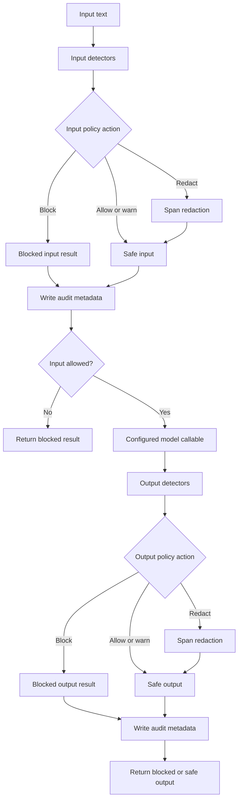

# SafeGate-360

[](https://github.com/didier-lioniello/SafeGate-360/actions/workflows/ci.yml)
[](https://github.com/didier-lioniello/SafeGate-360/actions/workflows/codeql.yml)

SafeGate-360 is a small, offline **reference implementation** of policy-driven guards
around a text-generation call. It exists to make detector, policy, redaction, failure,
and audit behavior easy to inspect and test.

It is not a production security product, a compliance control, or a guarantee that an
LLM application is safe. The included detectors are deliberately lightweight and can
be bypassed. Treat this repository as a starting point for threat modeling and
evaluation, not as a drop-in perimeter.

## What the reference demonstrates

- deterministic input and output detectors;
- explicit `allow`, `warn`, `redact`, and `block` policy actions;
- fail-closed handling for detector, policy, redaction, and model-call failures;
- central span redaction that composes without restoring previously hidden values;
- bounded input and output size;
- append-only JSONL audit metadata with HMAC fingerprints instead of raw text;
- synthetic probes assembled at runtime, with no live credentials or personal data.

The request flow is intentionally generic and mirrors `core/gate.py`:



No network call is required by the demo. The only runtime dependency is Click for the
CLI. An application can provide its own model callable to `SafeGate`.

## Quickstart

Python 3.11 or 3.12 is supported.

```bash
python3.11 -m venv .venv
source .venv/bin/activate
python -m pip install --require-hashes -r requirements-lock.txt

python -m ruff check .
python -m ruff format --check .
python -m pytest
python -m pip_audit --strict -r requirements-lock.txt
python main.py audit --input examples/probes.jsonl
```

Exercise one stage with harmless text:

```bash
python main.py check "Summarize the public release notes."
```

Exercise input and output handling with a synthetic response built at runtime:

```bash
python main.py guard \
  --prompt "Draft a short reply." \
  --response-fixture synthetic_email
```

The command returns only allowed or redacted content. Batch audit output identifies a
probe by line number and never prints its ID or text.

## Library use

```python
from core import SafeGate
from policies import default_policy

gate = SafeGate(
    policy=default_policy(),
    llm_fn=lambda safe_prompt: "A deterministic response for this example.",
)
result = gate.guard("Summarize the public notes.")

if result.allowed:
    print(result.output_text)
else:
    print(result.reason)
```

`guard()` blocks when no callable is configured. This avoids accidentally presenting
an input-only check as end-to-end protection. When input policy redacts content, both
the model callable and output detectors receive the post-policy safe prompt rather than
the original text.

## Audit behavior

By default, records are appended to `.safegate/audit.jsonl`. Set
`SAFEGATE_LOG_PATH` to choose another location. New audit files are created with mode
`0600`; a write failure raises `AuditWriteError`.

Audit records contain decision metadata, detector categories, counts, latency, and
keyed HMAC fingerprints. They do **not** contain raw input, output, matched values, or
detector reasons. A random in-memory HMAC key is used by default. Supply at least 32
random bytes through the `audit_hmac_key` constructor argument when stable correlation
across processes is required, and load that key from a secret manager rather than from
source control.

Fingerprints and detector categories can still be sensitive operational metadata.
Retention, rotation, access control, monitoring, and deletion remain the deployer's
responsibility.

## Default policy

The demonstration policy redacts structured PII; blocks credential-shaped input and
output, common jailbreak and prompt-injection markers, and lexical toxicity signals;
and warns on a weak ungrounded-claim heuristic. Any triggered detector without a
matching rule blocks by default.

Policies must be calibrated against representative data. A threshold is not a security
guarantee, and a clean result means only that these particular detectors did not fire.

## Known limitations

- Regex and lexical detectors miss paraphrases, obfuscation, other languages, and new
  credential formats.
- The toxicity signal is a tiny deterministic word list, not a classifier.
- The hallucination signal counts a few claim markers; it does not establish factuality
  or grounding.
- Structured PII coverage is limited and is not locale-complete.
- HMAC audit fingerprints are pseudonymous, not anonymous.
- The reference does not provide authentication, authorization, rate limiting, a model
  sandbox, prompt isolation, audit rotation, or a SIEM integration.
- A malicious custom detector executes in the application process. Isolate untrusted
  extensions separately.
- Tests demonstrate expected behavior for known fixtures; they do not prove security.

Before any real deployment, define a threat model, add model- and domain-specific
evaluations, test adversarial and multilingual inputs, review data flows, and arrange
independent security and privacy review.

## Dependency and build controls

`requirements.txt` is the exact direct runtime manifest. `requirements-dev.in` adds
exact direct pins for build, audit, test, lint, and lock-generation tools.
`requirements-lock.txt` is the generated transitive snapshot, including SHA-256 hashes
for every accepted distribution artifact. `scripts/verify_lock.py` checks alignment
between those files, the build requirement, project metadata, and (optionally) the
installed direct versions.

The hash-checked lock narrows CI and local-QA inputs; it is not a claim that the
environment is hermetic. The selected Python interpreter, package index availability,
initial installer, operating system, and upstream artifact publication remain trust
boundaries. Application consumers can use the compatible Click range declared in
`pyproject.toml`; the audited repository QA path uses the exact lock.

## Evidence

- `tests/test_gate.py` exercises the complete input, detector, policy, redaction or
  block, audit, model-call, output-detector, and final-result flow.
- `tests/test_redaction.py` covers composition, overlap, malformed spans, and label
  sanitization; `tests/test_policy.py` covers thresholds, severity, and unmatched rules.
- `tests/test_detectors.py` uses runtime-built synthetic identifiers and credential
  shapes; `tests/test_cli.py` verifies that batch output does not echo probe content.
- `tests/test_supply_chain.py` verifies dependency metadata and that the packaged probe
  asset is addressable through Python resources.
- `.github/workflows/ci.yml` installs the hash-checked lock, independently regenerates
  it, runs blocking Ruff, Pytest, and `pip-audit`, then builds and smoke-tests the wheel,
  console entry point, and packaged asset on Python 3.11 and 3.12.
- `python main.py audit --input examples/probes.jsonl` is the local, offline evidence
  command; it exits nonzero on a decision mismatch.

## Security and contributions

See [SECURITY.md](SECURITY.md) for private vulnerability reporting and
[CONTRIBUTING.md](CONTRIBUTING.md) for the no-live-data fixture policy and local checks.

## License

MIT. See [LICENSE](LICENSE).
